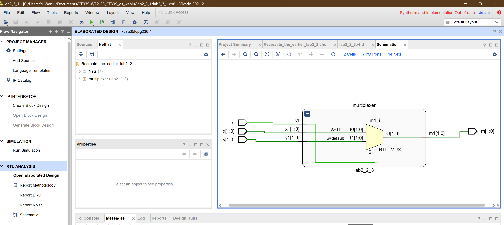

<!--
 * @Author: YuWenlu wy19403@essex.ac.uk
 * @Date: 2023-02-12 14:17:37
 * @LastEditors: YuWenlu wy19403@essex.ac.uk
 * @LastEditTime: 2023-02-12 16:02:18
 * @FilePath: \22-23_CE339_yu_wenlu\lab2_3_1\lab2_3_1.md
 * @Description: 这是默认设置,请设置`customMade`, 打开koroFileHeader查看配置 进行设置: https://github.com/OBKoro1/koro1FileHeader/wiki/%E9%85%8D%E7%BD%AE
-->

# CE339 Lab2_3_1 Re-create the earlier lab 2-2 using structural modeling.
#### By _**{Yu Wenlu wy19403@essex.ac.uk}**_

### This project is an assignment submission for the CE339 High Level Digital Design

## Technologies Used

* _Simulation system: Vivado 2021.2_
* _Target hardware: a Digilent Basys3 board with a Xilinx FPGA: xc7a35tcpg236-1_
* _Programming languages: VHDL, C_

## Description
This creates an instance of the earlier lab2_2_3 component. The new entity is named Recreaate_the_earlier_lab2_2.

The Recreaate_the_earlier_lab2_2 entity has the same inputs and outputs as the lab2_2_3 component: x, y, s, and m. The component lab2_2_3 is defined as a component within the Behavioral architecture of the new entity.

The multiplexer instance of lab2_2_3 is created using the port map directive, which maps the inputs and outputs of the component to signals in the entity. The inputs x1, y1, s1 of the component are mapped to x, y, s respectively, and the output m1 of the component is mapped to m.

In this way, the functionality of the lab2_2_3 component is reused in the Recreaate_the_earlier_lab2_2 entity, which implements the same 2-to-1 multiplexer function for two-bit vectors.

## Performance

