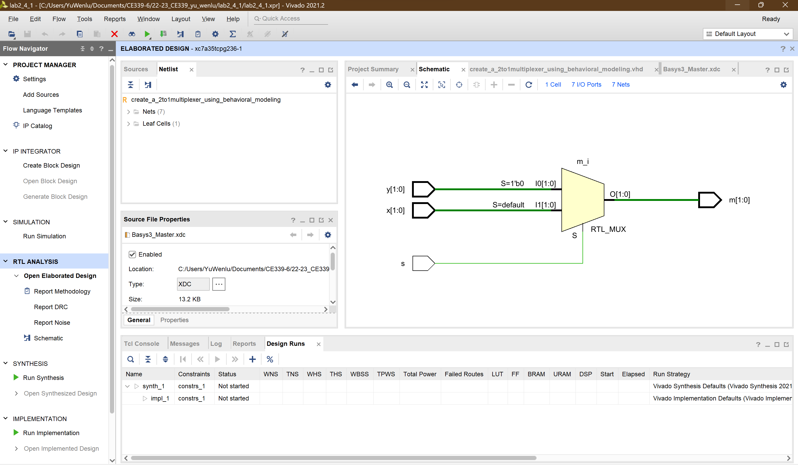

<!--
 * @Author: YuWenlu wy19403@essex.ac.uk
 * @Date: 2023-02-12 14:17:48
 * @LastEditors: YuWenlu wy19403@essex.ac.uk
 * @LastEditTime: 2023-02-12 16:13:05
 * @FilePath: \22-23_CE339_yu_wenlu\lab2_4_1\lab2_4_1.md
 * @Description: 这是默认设置,请设置`customMade`, 打开koroFileHeader查看配置 进行设置: https://github.com/OBKoro1/koro1FileHeader/wiki/%E9%85%8D%E7%BD%AE
-->

# CE339 Lab2_4_1 Create a two-bit wide 2-to-1 multiplexer using behavioral modeling.

#### By _**{Yu Wenlu wy19403@essex.ac.uk}**_

### This project is an assignment submission for the CE339 High Level Digital Design

## Technologies Used

* _Simulation system: Vivado 2021.2_
* _Target hardware: a Digilent Basys3 board with a Xilinx FPGA: xc7a35tcpg236-1_
* _Programming languages: VHDL, C_

## Description
The multiplexer has 3 input signals: x and y are the 2 data inputs and s is the select input. The multiplexer has 1 output signal m which is the output of the multiplexer.

In the architecture, a concurrent process is defined which implements the logic for the multiplexer. The process is triggered whenever any of the input signals x, y, and s change. The logic inside the process uses an if-else statement to determine the value of m based on the value of s. If s is '0', m is assigned the value of y. If s is '1', m is assigned the value of x. This implements the basic functionality of a 2-to-1 multiplexer.

## Performance

