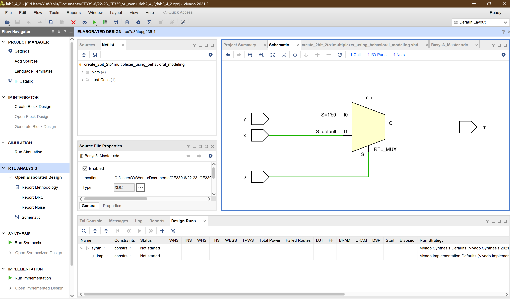

# CE339 Lab2_4_2 Create 2-to-1 multiplexer using behavioral modeling.

#### By _**{Yu Wenlu wy19403@essex.ac.uk}**_

### This project is an assignment submission for the CE339 High Level Digital Design

## Technologies Used

* _Simulation system: Vivado 2021.2_
* _Target hardware: a Digilent Basys3 board with a Xilinx FPGA: xc7a35tcpg236-1_
* _Programming languages: VHDL, C_

## Description
This VHDL code creates an entity create_2bit_2to1multiplexer_using_behavioral_modeling that implements a 2-bit 2-to-1 multiplexer. It takes two input signals x and y of type STD_LOGIC, and a selection signal s of type STD_LOGIC. The multiplexer outputs the selected signal m of type STD_LOGIC.

The behavior of the multiplexer is implemented in the Behavioral architecture using a concurrent process. The process sensitivity list includes the inputs x, y, and s. Inside the process, an if-else statement is used to select either x or y based on the value of s. If s is equal to '0', then m is assigned y, otherwise m is assigned x.

## Performance
